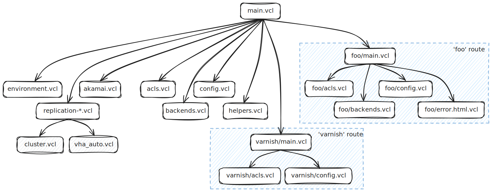
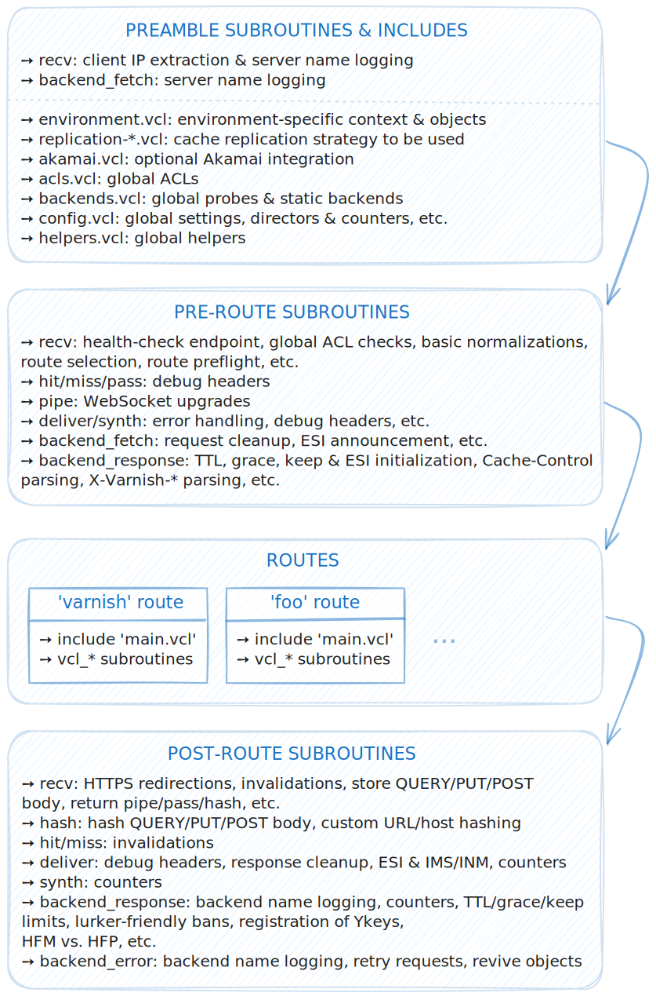
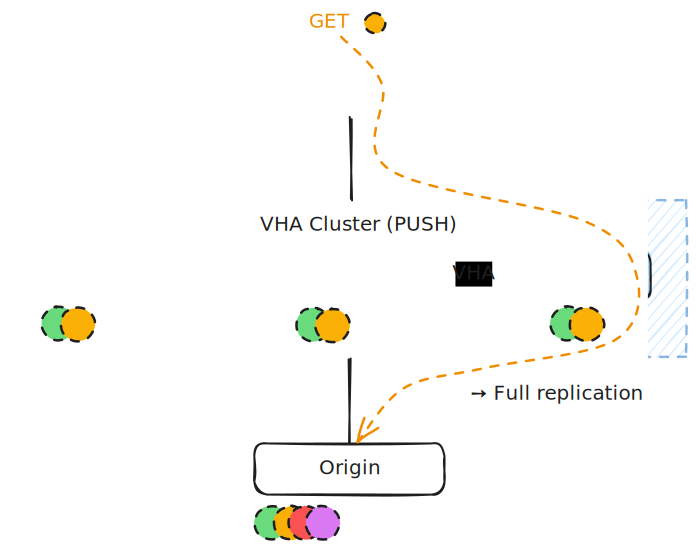
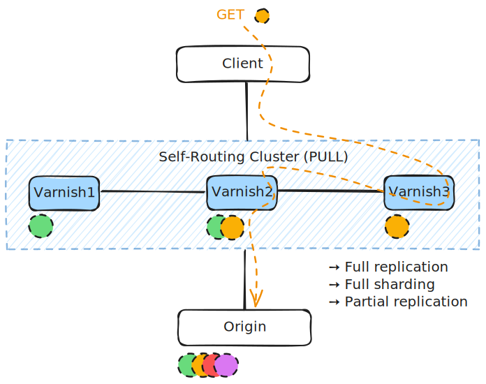

[](../../actions/workflows/main.yml)

<h1>
  <p align="center">
    
    <br />VCLSKi
  </p>
</h1>
<p align="center">
  <strong>Allenta's opinionated VCL Starter Kit to kickstart your Varnish Enterprise journey</strong>
  <br />
  <a href="#-about">About</a>
  ·
  <a href="#-quick-start">Quick Start</a>
  ·
  <a href="#-overview">Overview</a>
  ·
  <a href="#-q--a">Q & A</a>
  ·
  <a href="#-license">License</a>
</p>

## 💡 About

VCL (Varnish Configuration Language) is the secret sauce that makes [Varnish Enterprise](https://www.varnish-software.com/products/varnish-enterprise/) so powerful and flexible. But starting a VCL configuration from scratch? That can be intimidating. The goal of VCLSKi (VCL Starter Kit) is to provide a **solid foundation for Varnish Enterprise users to build upon**, while also serving as a **reference for best practices and common patterns in VCL development**.

There's no such thing as a one-size-fits-all VCL. Every setup has its own quirks and requirements. VCLSKi is **our opinionated take on VCL, shaped by 10+ years of working with Varnish Enterprise** in all sorts of environments, and built on top of the [extensive library of VMODs (Varnish Modules) provided by Varnish Software](https://docs.varnish-software.com/varnish-enterprise/vmods/).

Sometimes it might be more than you need; other times, not quite enough. Either way, **it's a starting point to ease the pain of writing VCL from scratch**, and also a resource you can learn from and adapt to your own needs.

## 🚀 Quick Start

VCLSKi is a starting point, not a plug-and-play solution. You'll need to tweak it to match your own setup. Here's **the quick way to get rolling**:

  1. Go through [the VCL files](vcl/), especially any comments marked with `TODO`. These highlight spots you'll probably want to customize.
  2. Make your first [route](#routes) by renaming [the `foo` example route](vcl/foo/) to something that fits your needs.
      - Be sure to update the `recv_decide_route` subroutine in `main.vcl` so requests are routed to your new route, as well as the include statement to pull in your route's VCL files.
      - [Bonus tidiness points](#naming-conventions--best-practices) if you also rename the objects, subroutines, HTTP headers, etc. prefixed with `foo`/`Foo` in your route's VCL files.
  3. Add as many routes as you want, just follow the same skeleton as before. Keep iterating and expanding as you go, using the best practices and tips in the comments as your guide and the [Varnish Enterprise documentation](https://docs.varnish-software.com/varnish-enterprise/) as your reference.

## 🧩 Overview

The VCLSKi file structure is made up of a few folders and several VCL files. At the root, you'll find **[`main.vcl`](vcl/main.vcl), which acts as the main configuration file**. This is where the core logic lives, along with some quick-start documentation to help you get going.

Think of `main.vcl` as the **foundation that all routes** (more about this shortly, but you can think of routes as virtual hosts in an Apache or Nginx configuration) build upon, trying to be as general and route-agnostic as possible.



VCLSKi's `main.vcl` is packed with comments and examples to show you how things fit together, but you'll want to tweak and build on it as you go. Just be careful not to mess with the core logic: try to keep it as route-agnostic as you can. The file is organized into **four main sections** that control how requests flow through Varnish:
  - The **preamble section** at the top sets the stage for request processing.
  - The **pre-route section** handles early processing common to all routes.
  - The **route section** contains route-specific logic, with each route living in its own folder and having its own VCL files.
  - The **post-route section** contains shared logic that runs after route-specific processing.



### Routes

Routes are a key idea in VCLSKi, and **each one lives in its own folder**. Out of the box, you get two example routes: [`varnish`](vcl/varnish/), which handles a couple of internal synthetic endpoints, and [`foo`](vcl/foo/), which acts as a catch-all for anything that doesn't match another route. The `foo` route is also a handy reference for building your first own route.

Each route comes with **its own main VCL file (`<route>/main.vcl`), its own configuration (`<route>/config.vcl`), and its own backends and ACLs (`<route>/backends.vcl` and `<route>/acls.vcl`)**. The `foo` route is a great example. It's packed with comments explaining why it's set up the way it is, how to use it, and what you typically need to do when handling HTTP requests. Picking the right route for each request happens in `main.vcl`, thanks to the `recv_decide_route` subroutine.

**Top-level configuration lives in `config.vcl`**, which acts as the base for all routes. Each route is free to override or extend this configuration as needed. The same goes for backends and ACLs: you can define them per route, or share them across routes by putting them in the root `backends.vcl` and `acls.vcl` files.

**Why not just use [VCL labels](https://www.varnish.org/docs/users-guide/vcl-separate/) to handle routes?** Labels are definitely a powerful feature for organizing VCL, but in our experience, they're not always the best fit. The straightforward approach used in VCLSKi is easier to follow and maintain.

### Replication options

When you use VCLSKi in more than one Varnish Enterprise server, you have **three ways to handle cache replication**. You should only include one of these options in your `main.vcl` at a time:

  - **[`replication-disabled.vcl`](vcl/replication-disabled.vcl)**: no replication at all. Each server keeps its own cache, totally separate from the others. This is the default, and it's perfect for getting started or if you just want to keep things simple.

  - **[`replication-vha.vcl`](vcl/replication-vha.vcl)**: enables replication using [Varnish High Availability (VHA)](https://docs.varnish-software.com/varnish-high-availability/). It's a solid choice if you want basic cache syncing between nodes.

    

  - **[`replication-cluster.vcl`](vcl/replication-cluster.vcl)**: uses [Varnish Cluster](https://docs.varnish-software.com/varnish-enterprise/features/cluster/) for replication. This is usually the best option for most setups, as it offers more advanced features, but it can be a bit trickier to debug compared to VHA.

    

Pick the one that fits your needs, follow specific setup instructions for the solution of your choice if doing any replication at all (for VHA, [here](https://docs.varnish-software.com/varnish-high-availability/installation/); for Varnish Cluster, [here](https://docs.varnish-software.com/varnish-enterprise/features/cluster/#getting-started)), and then include VCLSKi's corresponding VCL in `main.vcl` to make your configuration replication-friendly.

### Akamai integration

Including [`akamai.vcl`](vcl/akamai.vcl) is another optional feature. This file offers a well-documented **example of how to integrate Varnish Enterprise as an origin for Akamai**. It covers common considerations and best practices for this type of integration.

### Naming conventions & best practices

Even the best starter VCL won't save you if you don't stick to **clear naming conventions** (like prefixing objects and subroutines with the route name), **avoid spaghetti code** (for example, don't create dozens of `vcl_recv` subroutines and rely on include order), and **make an effort to keep things tidy and well-documented**. Otherwise, your configuration will turn into a mess before you know it.

VCLSKi shows off some of these best practices, but it's up to you to keep things clean as you extend and customize it. **Take a good look through the VCLSKi implementation before you start making changes**.

### Features

The top-level VCL and the example routes in VCLSKi cover a **wide range of features and use cases**, including:

  - **Global and per-route settings** powered by the [kvstore VMOD](https://docs.varnish-software.com/varnish-enterprise/vmods/kvstore/): flip on passthrough mode, set up HTTPS redirects, limit the size of cacheable PUT & POST requests, control backend retries, and more. VCLSKi's VCL sets up four kvstore objects:
    + `config` (global scope): for global and per-route settings.
    + `request` (request scope): for task-specific data. Useful to track state in backend tasks without leaking info to the origins via custom HTTP headers.
    + `counters` (global scope): for quick-and-dirty counters you can see in `varnishstat` and the stats endpoints in the `varnish` route.
    + `environment` (global scope): for environment-specific context. Great for making the VCL logic adapt to different environments without having separate configurations for each one.

  - **Synthetic endpoints** for health checks, metrics scraping, and more:
    + `/health-check/`, for upstream health checks.
    + `/varnish/stats/json/` & `/varnish/stats/prometheus/`, to expose Varnish stats in JSON or Prometheus format using the [stat VMOD](https://docs.varnish-software.com/varnish-enterprise/vmods/stat/).
    + `/varnish/flush/`, to flush the whole cache using the [ykey VMOD](https://docs.varnish-software.com/varnish-enterprise/vmods/ykey/) and a wildcard Ykey.

  - **Marker files** to toggle features on the fly:
    + `/etc/varnish/maintenance`, to turn maintenance mode on, changing what `/health-check/` returns.
    + `/etc/varnish/disabled-VHA-replication`, to disable [VHA replication](https://docs.varnish-software.com/varnish-high-availability/) if you're using `replication-vha.vcl`.
    + `/etc/varnish/disabled-cluster`, to disable [self-routing](https://docs.varnish-software.com/varnish-enterprise/features/cluster/) if you're using `replication-cluster.vcl`.

  - **Built-in support for the [accounting VMOD](https://docs.varnish-software.com/varnish-enterprise/vmods/accounting/)**, using the route name as the accounting namespace.

  - **Support for every kind of cache invalidation**, protected by an ACL and, optionally, a HMAC-based authentication mechanism using the [digest VMOD](https://docs.varnish-software.com/varnish-enterprise/vmods/digest/):
    + Hard and soft purges with the [purge VMOD](https://docs.varnish-software.com/varnish-enterprise/vmods/purge/).
    + Hard and soft Ykey invalidations with the [ykey VMOD](https://docs.varnish-software.com/varnish-enterprise/vmods/ykey/), including namespaced per-route Ykeys.
    + Bans, including an optional per-route ban expression prefix.
    + Forced cache misses.

  - **Support for extented `Cache-Control` directives**, including `stale-while-revalidate` and `stale-if-error`, as well as other `X-Varnish-*` headers to control Varnish behavior from the backend side.

  - **Bringing stale objects back to life if the backend fails** thanks to the [stale VMOD](https://docs.varnish-software.com/varnish-enterprise/vmods/stale/).

  - **Extra internal headers and VSL records you can use to beef up your NCSA logs** with more useful info about each request:
    ```json
    ...
    "client":         "%{X-Client-Ip}i",
    "server":         "%{VSL:VCL_Log:Server}x",
    "cluster-origin": "%{VSL:VCL_Log:Cluster-Origin}x",
    "backend":        "%{VSL:VCL_Log:Backend}x",
    ...
    ```

  - **Optional injection of `X-Varnish-Debug-*` headers** to help with debugging and tracing requests through the cache.

  - **A hands-on example route that shows off the [urlplus](https://docs.varnish-software.com/varnish-enterprise/vmods/urlplus/), [cookieplus](https://docs.varnish-software.com/varnish-enterprise/vmods/cookieplus/), and [headerplus](https://docs.varnish-software.com/varnish-enterprise/vmods/headerplus/) VMODs.**

  - **Example integration of the APW (Advanced Paywall) feature** for high-performance server-side paywall implementations.

In our experience, most of these features are the bare minimum for any VCL setup. But what you can do with VCL + VMODs goes way beyond this list. If you want to dig deeper, **these resources are a great place to start**:
  - The [Varnish Enterprise documentation](https://docs.varnish-software.com/varnish-enterprise/), especially the list of [available VMODs](https://docs.varnish-software.com/varnish-enterprise/vmods/).
  - The [Varnish Book](https://docs.varnish-software.com/book/).
  - The [tutorials in the Varnish Developer Portal](https://www.varnish-software.com/developers/tutorials/).
  - The [Varnish Cache Documentation](https://www.varnish.org/docs/index.html).

## 🤔 Q & A

<details>
<summary><strong>What if I want to discover my backends dynamically?</strong></summary><br/>

VCLSKi already gives you a single dynamic backend (`default_template_be` in `environment.*.vcl`) plus a director (`default_dir` in `config.vcl`) shared by all routes. You don't strictly need this setup (static backends are totally fine), but it's really handy if you want to automate VCL testing or keep one VCL config across all environments. Out of the box, this is powered by a **combination of the [udo VMOD](https://docs.varnish-software.com/varnish-enterprise/vmods/udo/) and the [activedns VMOD](https://docs.varnish-software.com/varnish-enterprise/vmods/activedns/)**.

If you'd rather discover backends from a `backends.conf` file using the [nodes VMOD](https://docs.varnish-software.com/varnish-enterprise/vmods/nodes/), the end result is pretty much the same:
```vcl
sub vcl_init {
    ...

    # Default director, potentially useful across multiple routes.
    if (environment.get("id") != "local") {
      nodes.set_default_probe_template(default_template_probe);
    }
    nodes.set_default_backend_template(default_template_be);
    new default_nodes_conf = nodes.config_group(
        utils.lookup_file("backends.conf"),
        group=environment.get("default-be-tag"));

    new default_dir = udo.director(random);
    default_dir.subscribe(default_nodes_conf.get_tag());

    ...
}
```

For additional discovery options, check out [Varnish Discovery](https://docs.varnish-software.com/varnish-high-availability/autoscaling/).
</details>

<details>
<summary><strong>How to automate deployments of my VCL files?</strong></summary><br/>

[Varnish Controller](https://www.varnish-software.com/products/varnish-controller/) is your best bet for automating VCL deployments. For a more DIY approach, **VCLSKi ships [a minimal Ansible playbook](extras/ansible/) for deploying the VCL stored in the `vcl/` folder**. The playbook assumes the following configuration on the Varnish Enterprise servers:
  - `/var/lib/varnish/.staging/` serves as the staging area during deployments.
  - `/etc/varnish/vcl/` is the location for the active VCL. This requires Varnish to run with: (1) `-p vcl_path=/etc/varnish/vcl:/usr/share/varnish-plus/vcl` (the default is `/etc/varnish:/usr/share/varnish-plus/vcl`); and (2) `-f /etc/varnish/vcl/main.vcl`.

Just like VCLSKi's VCL files, the playbook is a starting point for you to tweak to fit your setup. It's super simple:
  1. Copies everything from `vcl/` to `/etc/varnish/vcl/`.
  2. Updates the dynamically generated `environment.vcl` file.
  3. Can show a diff and ask for confirmation before going ahead.
  4. Reloads the service running `systemctl reload varnish`, if needed.

Usage is straightforward, specially if you're familiar with [uv](https://docs.astral.sh/uv/):
```bash
$ uv run --quiet --python 3.12 --with ansible==13.1.0 ansible-playbook \
    --inventory hosts.yml \
    --extra-vars '{"cfg": {"serial": 8, "rsync": true, "check": true, "diff": true, "prompt": false}}' \
    --forks 8 \
    --user alice \
    --become \
    --verbose \
    --limit pro \
    --diff \
    vcl-deployment-playbook.yml
```

If you want to deploy one server at a time and get a confirmation prompt before each one, just set `serial` to `1` and `prompt` to `true`. You can tweak how the playbook runs by changing the variables in the `--extra-vars` JSON:
  - `serial` (default: `1`): how many servers to deploy to in parallel.
  - `source` (default: `<playbook location>/vcl/`): the folder where the files to deploy are located.
  - `rsync` (default: `true`): use `rsync` (faster) instead of `copy` to move files to the remote staging area (`/var/lib/varnish/.staging/`).
  - `check` (default: `true`): check the transferred VCL with `varnishd -C` before copying it to `/etc/varnish/vcl/`.
  - `diff` (default: `true`): show the differences between the new VCL (`/var/lib/varnish/.staging/`) and what's currently live (`/etc/varnish/vcl/`).
  - `prompt` (default: `true`): ask for confirmation before copying VCL to `/etc/varnish/vcl/`.

Quick reminders: (1) set `--user` to your username; (2) use `--limit` to make sure you're targeting the right servers in `hosts.yml`; (3) use `--check` to do a dry run if you're not sure; and (4) if your Varnish servers don't have passwordless sudo, you'll need `--ask-become-pass`.
</details>

<details>
<summary><strong>I've got multiple environments (dev, staging, etc.), each with a slightly different VCL config. What's the best way to handle that?</strong></summary><br/>

It's totally normal to have slightly different VCL configs for each environment. We like to keep things tidy by using **parallel Git branches for each environment**, instead of folders or template systems. Branches make it easy to see what's different across environments, cherry-pick changes, and keep everything organized. Just try to keep the differences small, so your branches don't drift too far apart and it's easy to spot any unexpected divergences.

If you're up for a bit more work, you could even have a **single VCL configuration that works for all environments by using context about the environment and some VCL logic to handle the differences**. Depending on your setup, that extra effort might be worth it! The [example Ansible playbook](extras/ansible/vcl-deployment-playbook.yml) shows how you can whip up a [`environment.vcl`](vcl/environment.vcl) file on the fly with environment-specific details: super handy to have a single VCL configuration that adapts to each environment. Out of the box, VCLSKi already showcases this approach by using the `environment` kvstore object to decide how to adapt the only backend in the configuration based on the environment.
</details>

<details>
<summary><strong>Can VCLSKi be used with Varnish Cache?</strong></summary><br/>

[Varnish Cache](https://www.varnish.org) is a downstream version of [Vinyl Cache](https://vinyl-cache.org), and both are the base for Varnish Enterprise. VCLSKi was built with the VMODs from Varnish Enterprise in mind, and some features (like VHA or Varnish Cluster) are only in the Enterprise edition. But if you like how VCLSKi is organized, **you can totally adapt it for Varnish Cache or Vinyl Cache; just remove or swap out the Enterprise-only features and VMODs**. It's meant to be a starting point, so making it work elsewhere shouldn't be a big deal.
</details>

<details>
<summary><strong>I want to contribute to VCLSKi. How can I help?</strong></summary><br/>

This is our very opinionated take on a VCL starter kit, but we're always happy to hear ideas and contributions. If you spot an error, find a clearer way to explain something, or want to suggest a new feature, feel free to open an issue or submit a pull request. **We welcome any contribution that helps make VCLSKi better for everyone**.
</details>

## 📝 License

Please refer to [LICENSE.txt](LICENSE.txt) for more information.

Copyright (c) [Allenta Consulting S.L.](https://allenta.com)

----
Made with :heart: by the Varnish guys at [Allenta](https://allenta.com).
